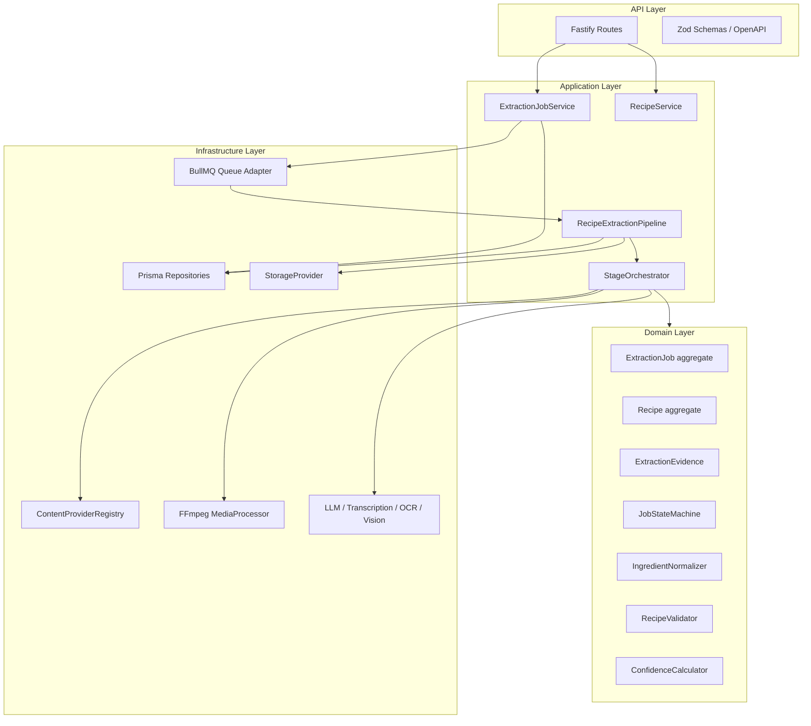
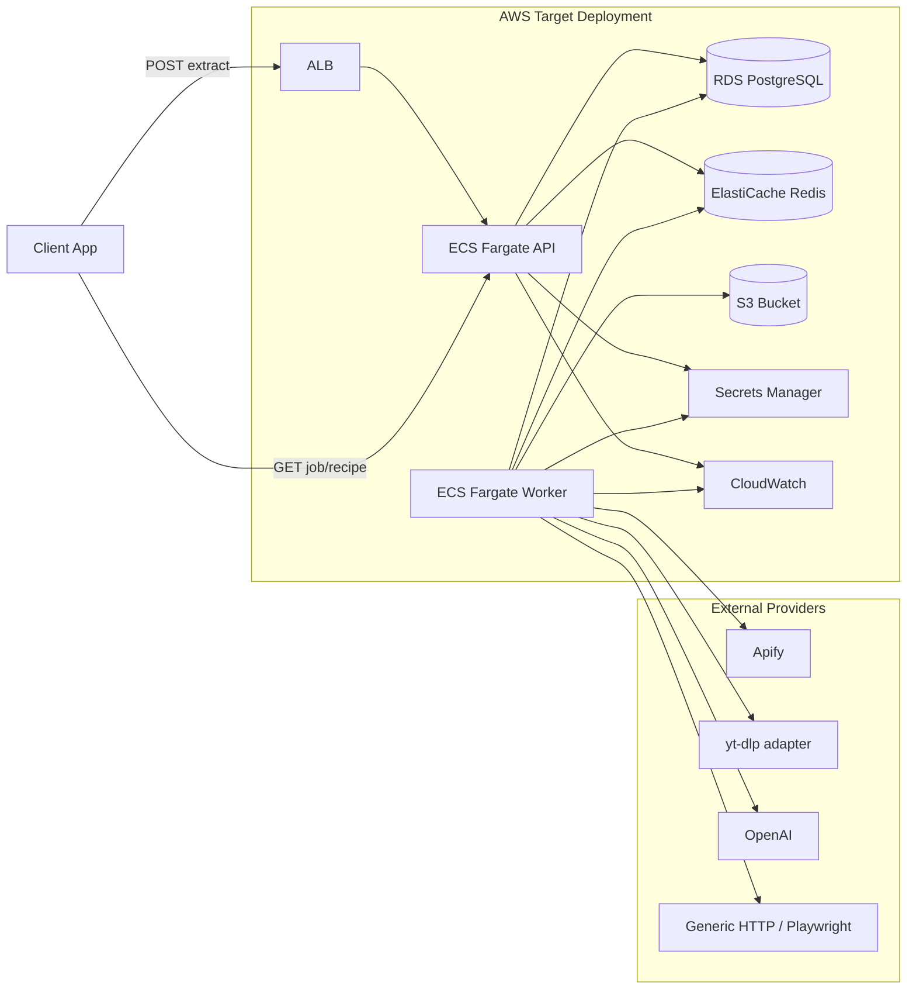
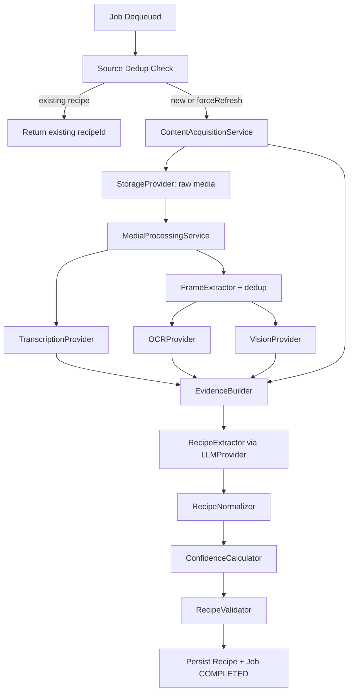
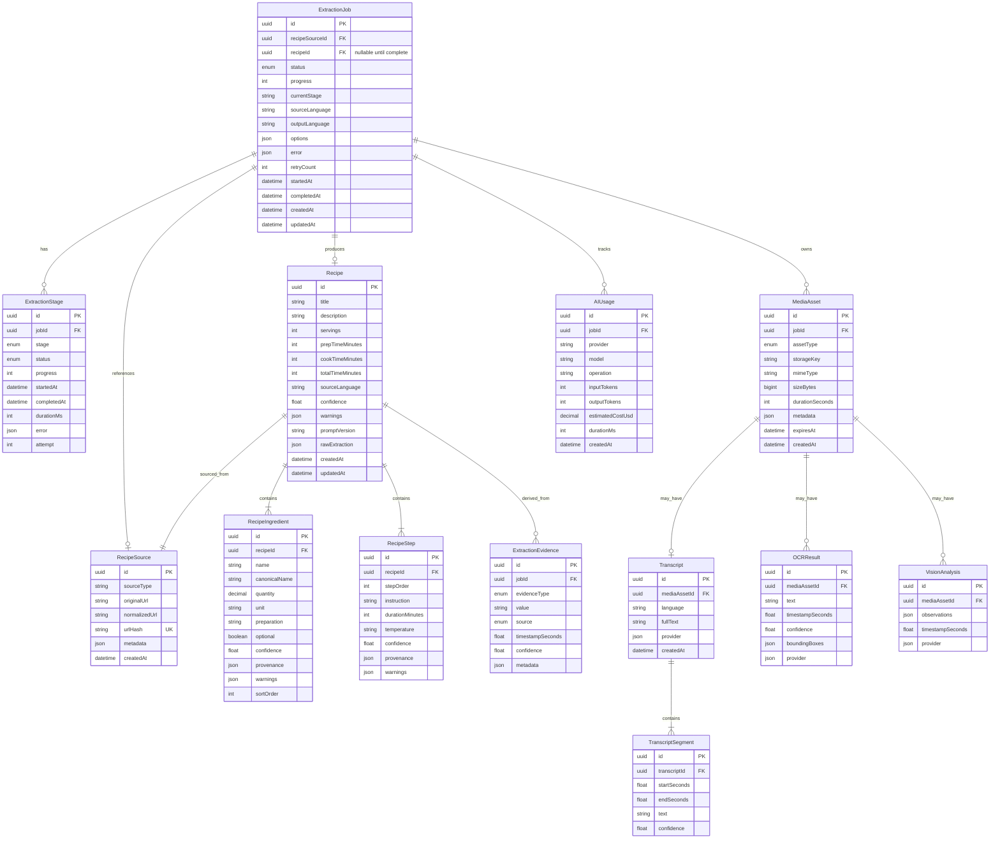
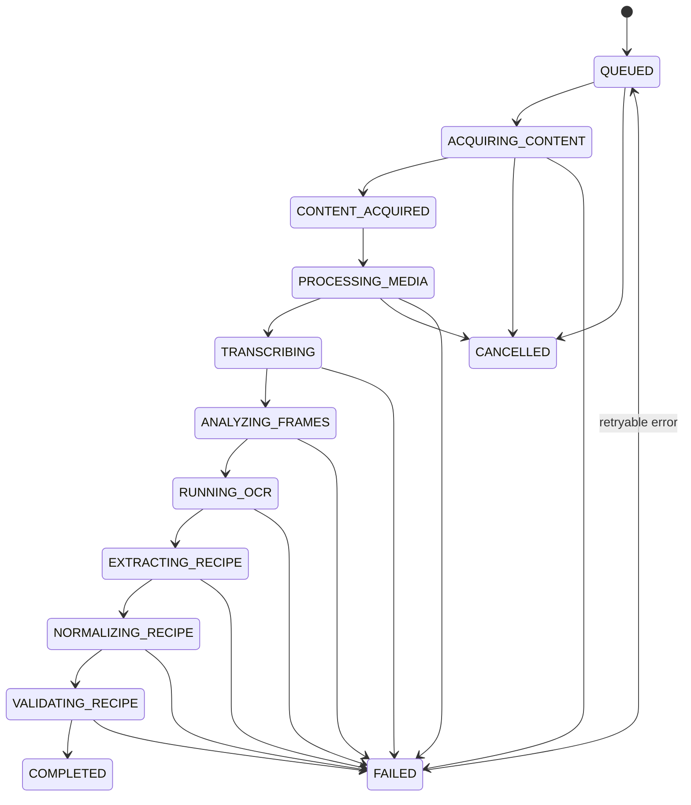
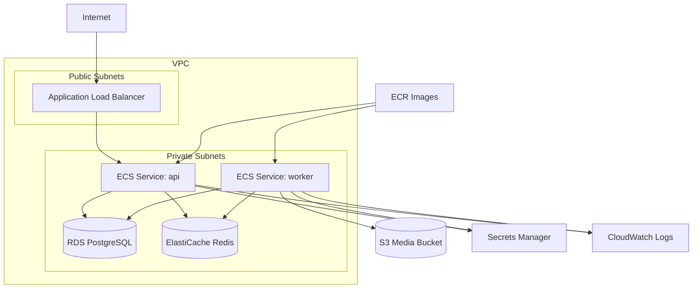
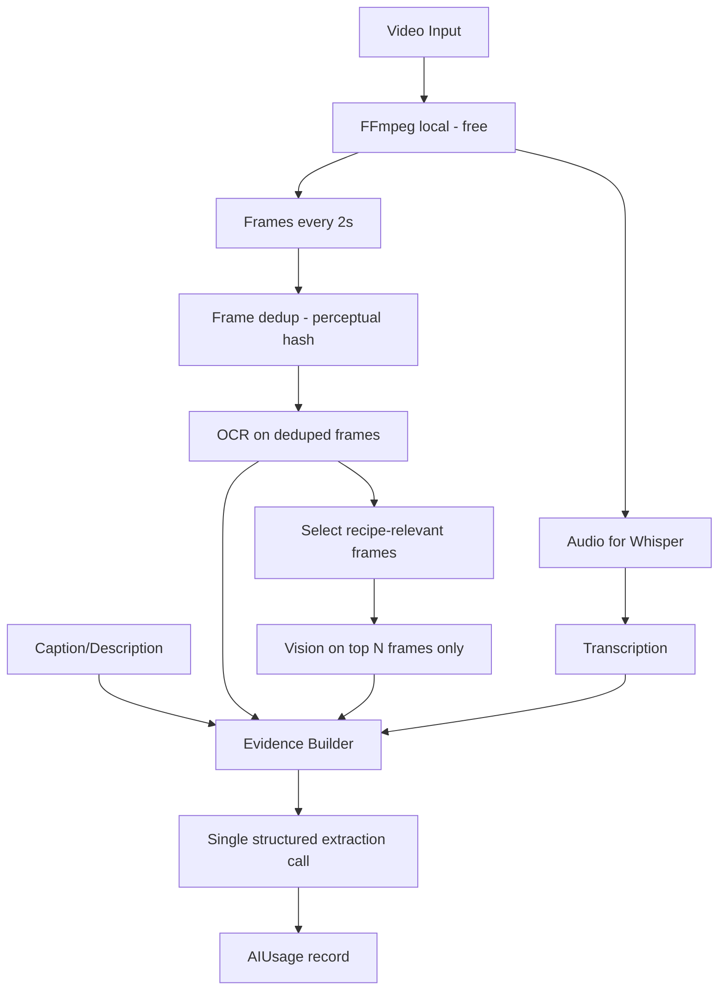

# Recipe Extraction API — Architecture

This document describes the target architecture for evolving the existing Fastify API scaffold into an asynchronous recipe extraction platform. It is the authoritative reference for structure, data model, pipeline behaviour, and deployment.

---

## Table of contents

1. [Context and goals](#1-context-and-goals)
2. [Layered architecture](#2-layered-architecture)
3. [Runtime processes](#3-runtime-processes)
4. [Directory structure](#4-directory-structure)
5. [Component diagram](#5-component-diagram)
6. [Database model](#6-database-model)
7. [API specification](#7-api-specification)
8. [Extraction state machine](#8-extraction-state-machine)
9. [Queue architecture](#9-queue-architecture)
10. [External provider interfaces](#10-external-provider-interfaces)
11. [AWS deployment](#11-aws-deployment)
12. [Security model](#12-security-model)
13. [Cost model](#13-cost-model)
14. [Implementation phases](#14-implementation-phases)
15. [Risks and mitigations](#15-risks-and-mitigations)
16. [MVP scope](#16-mvp-scope)
17. [Integration with existing code](#17-integration-with-existing-code)
18. [Current platform (delivery)](#18-current-platform-delivery)

---

## 1. Context and goals

The workspace contains a production Fastify API (`src/app/`, `src/config/env.ts`, Docker, Vitest, OpenAPI, rate limiting, structured errors) **plus** recipe domain logic: PostgreSQL persistence, BullMQ extraction worker, singleton profile ownership, immutable revisions, pantry organization, collections, engagement, and cook sessions.

This evolution **preserves existing conventions**:

- Zod validation for every external input
- `{ data }` response envelopes for resource endpoints
- Typed `AppError` hierarchy with machine-readable `error.code`
- `buildApp()` testability via `app.inject()`
- Environment-only configuration (ECS / Secrets Manager compatible)

**Structural evolution:** migrate from `src/features/` (demo CRUD) to a layered layout under `src/modules/`. The `example` feature is removed once real recipe endpoints ship.

### Design principles

| Principle | Rationale |
|-----------|-----------|
| **ExtractionJob is the aggregate root** | All pipeline stages update the same job record; clients poll one id |
| **PostgreSQL is source of truth** | Job state, recipes, artifacts; Redis is ephemeral queue transport only |
| **Idempotent stages** | Each stage checks for existing artifacts before re-running |
| **Provider interfaces everywhere** | No direct OpenAI / Apify / S3 calls in domain code |
| **Evidence-first extraction** | AI consumes structured evidence, not raw blobs |
| **Deterministic confidence** | LLM proposes facts; confidence service scores them |
| **Cost-aware pipeline** | Cheap local processing (FFmpeg) before expensive multimodal AI |

---

## 2. Layered architecture



### Layer responsibilities

| Layer | Location | Owns |
|-------|----------|------|
| **API** | `src/app/`, `src/modules/*/api/` | HTTP contract, validation schemas, thin controllers |
| **Application** | `src/modules/*/application/` | Use cases, orchestration, progress calculation |
| **Domain** | `src/modules/*/domain/` | Entities, value objects, state machines, invariants |
| **Infrastructure** | `src/infrastructure/` | Database, queue, storage, AI adapters, logging |

Domain and application code **must not import Fastify**. Services take plain arguments, return plain values, and throw `AppError`s.

---

## 3. Runtime processes

| Process | Role | Entry |
|---------|------|-------|
| **API** | Accept requests, create jobs, serve status/recipes | `src/index.ts` |
| **Worker** | Execute extraction pipeline asynchronously | `src/worker/index.ts` |
| **PostgreSQL** | Authoritative job/recipe/artifact state | RDS in production |
| **Redis** | BullMQ backend | ElastiCache in production |

The HTTP handler **never blocks** on media or AI work. `POST /recipes/extract` creates a job, enqueues work, and returns `{ jobId, status: "queued" }` immediately.

```text
Client ──POST /recipes/extract──▶ API ──enqueue──▶ Redis (BullMQ)
                                      │
                                      ▼
                                   PostgreSQL (job row)
                                      
Worker ◀──dequeue── Redis
  │
  ├──▶ Content providers (Apify, yt-dlp, HTTP)
  ├──▶ FFmpeg (audio, frames)
  ├──▶ OpenAI (transcription, vision, extraction)
  └──▶ PostgreSQL + local/S3 storage
```

---

## 4. Directory structure

```text
src/
  app/                              # Fastify bootstrap + plugins (existing)
  config/
    env.ts                          # grouped config: server, database, redis, storage, ai, extraction

  modules/
    jobs/
      domain/                       # ExtractionJob, JobStatus, state transitions
      application/                  # ExtractionJobService, progress calculator
      api/                          # routes, schemas, controller
      repository/                   # IExtractionJobRepository

    recipes/
      domain/                       # Recipe, Ingredient, Step, Source
      application/                  # RecipeService, RecipeExtractor
      api/
      repository/
      prompts/                      # versioned prompt templates
        recipe-extraction-v1.ts
        recipe-validation-v1.ts

    content/
      domain/                       # AcquiredContent, SourceType, ContentImage
      application/                  # ContentAcquisitionService
      providers/
        instagram/                  # InstagramContentProvider
        youtube/                      # YouTubeContentProvider
        facebook/                     # stub MVP
        tiktok/                       # stub MVP
        generic/                      # GenericWebContentProvider
      registry/                     # ContentProviderRegistry

    media/
      domain/                       # MediaAsset, FrameStrategy
      application/                  # MediaProcessingService
      ffmpeg/                       # FfmpegMediaProcessor

    transcription/
      domain/                       # Transcript, TranscriptSegment
      application/
      providers/openai/             # OpenAITranscriptionProvider

    ocr/
      domain/                       # OCRResult
      application/
      providers/llm-vision/         # LLMVisionOCRProvider (MVP)

    vision/
      domain/                       # VisionAnalysis
      application/
      providers/openai/             # OpenAIVisionProvider

    evidence/
      domain/                       # ExtractionEvidence, EvidenceType
      application/                  # EvidenceBuilder

    normalization/
      domain/                       # unit maps, ingredient rules
      application/                  # RecipeNormalizer, IngredientNormalizer

    validation/
      domain/
      application/                  # RecipeValidator, completeness checks

    confidence/
      application/                  # ConfidenceCalculator (deterministic)

    extraction/
      application/                  # RecipeExtractionPipeline, StageOrchestrator
      stages/                       # one file per stage

  infrastructure/
    database/
      prisma/                       # client singleton
      repositories/                 # Prisma implementations
    redis/
      client.ts
    queues/
      bullmq/                       # QueueProvider adapter
      names.ts                      # queue name constants
    storage/
      local/                        # LocalStorageProvider
      s3/                           # S3StorageProvider
      storage-provider.ts           # interface
    ai/
      llm/                          # LLMProvider interface + OpenAIProvider
      usage/                        # AIUsageTracker
    logging/                        # existing Pino logger
    security/
      ssrf-guard.ts                 # URL validation, private IP blocklist
    observability/
      sentry.ts                     # optional

  shared/
    errors/                         # AppError, ErrorCode
    types/
    utils/
    di/                             # lightweight composition root

  worker/
    index.ts                        # worker bootstrap
    processors/
      extraction.processor.ts       # primary job processor

  features/                         # legacy — health stays; example removed in Phase 9
    health/

prisma/
  schema.prisma
  migrations/

tests/
  unit/modules/...
  integration/database/...
  integration/pipeline/...
  integration/api/...
  fixtures/recipes/

docker-compose.yml                  # api + worker + postgres + redis
Dockerfile                          # api image
Dockerfile.worker                   # worker image (+ ffmpeg)
```

---

## 5. Component diagram

### External deployment (AWS target)



### Internal extraction pipeline



---

## 6. Database model

PostgreSQL 16+ is the authoritative store. Prisma manages schema and migrations.

### Entity-relationship diagram



### Indexes

| Table | Index | Purpose |
|-------|-------|---------|
| `ExtractionJob` | `(status)` | Worker polling, admin dashboards |
| `ExtractionJob` | `(createdAt)` | Time-range queries |
| `RecipeSource` | `(urlHash)` UNIQUE | Source deduplication |
| `RecipeSource` | `(sourceType, createdAt)` | Analytics |
| `RecipeIngredient` | `(canonicalName)` | Ingredient search |
| `Recipe` | `(createdAt)` | Listing pagination |

### Future extension: human corrections

Add a `RecipeRevision` table referencing `Recipe` with `revisionType: AI | USER`. Never overwrite `rawExtraction` or evidence rows — append revisions for auditability.

---

## 7. API specification

Base prefix: `/api/v1` (existing). Interactive docs at `/docs`.

### Endpoints

| Method | Path | Description |
|--------|------|-------------|
| `POST` | `/recipes/extract` | Create extraction job |
| `GET` | `/recipes/extract/jobs/:id` | Job status + progress |
| `POST` | `/recipes/extract/jobs/:id/cancel` | Cancel queued/running job |
| `POST` | `/recipes/preview` | Link preview (no job) |
| `GET` | `/recipes/:id` | Get effective revision |
| `PATCH` | `/recipes/:id` | Append immutable user revision |
| `GET` | `/recipes` | List recipes (`sort=latest\|engagement`) |
| `GET` | `/recipes/:id/revisions` | Revision history |
| `POST` | `/recipes/:id/revisions/:revisionId/restore` | Restore as a new head |
| `PUT` | `/recipes/:id/favorite` | Favorite |
| `PUT` | `/recipes/:id/rating` | Profile rating 1–5 |
| `POST` | `/recipes/:id/notes` | Annotation (not a revision) |
| `GET` | `/categories` | Profile categories |
| `GET` | `/collections` | Collections |
| `GET` | `/pantry` | Pantry items |
| `POST` | `/pantry/organize` | Plain-text organize (no save) |
| `POST` | `/cook-sessions` | Start or resume a cook |
| `GET` | `/ops/summary` | Operator aggregates (no PII) |
| `GET` | `/health` | Liveness |

### `POST /recipes/extract`

**Request:**

```json
{
  "url": "https://www.instagram.com/reel/...",
  "outputLanguage": "en",
  "forceRefresh": false,
  "options": {
    "extractImages": true,
    "highAccuracy": false
  }
}
```

Calories and macros are always extracted. The retired `options.extractNutrition` flag is accepted and ignored.

**Responses:**

- `202 Accepted` — new job queued: `{ "data": { "jobId": "uuid", "status": "queued" } }`
- `200 OK` — dedup hit: `{ "data": { "jobId": "uuid", "status": "completed", "recipeId": "uuid", "deduplicated": true } }`
- `400` — invalid URL / SSRF blocked: `UNSUPPORTED_SOURCE` or `INVALID_URL`
- `422` — validation error

### `GET /recipes/extract/jobs/:id`

```json
{
  "data": {
    "id": "uuid",
    "status": "processing",
    "progress": 65,
    "currentStage": "extracting_recipe",
    "recipeId": null,
    "error": null,
    "startedAt": "...",
    "completedAt": null
  }
}
```

### Error envelope

Extends the existing format:

```json
{
  "error": {
    "code": "UNSUPPORTED_SOURCE",
    "message": "The provided URL is not currently supported.",
    "requestId": "..."
  }
}
```

**Extraction-specific error codes** (added to `src/shared/errors/error-codes.ts`):

`UNSUPPORTED_SOURCE`, `INVALID_URL`, `JOB_NOT_FOUND`, `JOB_ALREADY_COMPLETED`, `JOB_CANCELLED`, `EXTRACTION_FAILED`, `CONTENT_ACQUISITION_FAILED`, `MEDIA_PROCESSING_FAILED`, `PROVIDER_RATE_LIMITED`

---

## 8. Extraction state machine



### Rules

- Every transition writes an `ExtractionStage` row (append-only audit trail)
- `ExtractionJob.status` mirrors the current pipeline stage
- Non-retryable failures go straight to `FAILED` with a stable error code
- Cancel is allowed from `QUEUED` through early processing stages only
- **Stage skip:** if an artifact already exists (idempotency), jump to the next stage without re-processing

### Progress weights (configurable via env)

| Stage | Weight |
|-------|--------|
| Acquisition | 10% |
| Media processing | 15% |
| Transcription | 20% |
| Frame analysis | 20% |
| Recipe extraction | 20% |
| Normalization | 5% |
| Validation | 10% |

---

## 9. Queue architecture

### MVP: single primary queue

```text
Queue: extraction-jobs
Consumer: ExtractionProcessor (worker process)
```

The processor runs `RecipeExtractionPipeline.execute(jobId)`, which sequences stages internally. Stage boundaries are explicit classes/functions so splitting into multiple queues later is trivial.

### Future split (interface-ready)

```text
content-acquisition
media-processing
transcription
vision
ocr
recipe-extraction
normalization
validation
```

### Queue abstraction

```typescript
interface QueueProvider {
  enqueue(jobName: string, payload: JobPayload, opts?: EnqueueOptions): Promise<void>;
  registerProcessor(name: string, handler: JobHandler): void;
}
```

BullMQ implements this interface today. A future SQS adapter swaps without touching pipeline code.

### Retry policy

| Error type | Retry | Backoff |
|------------|-------|---------|
| Network timeout | Yes | Exponential, max 5 |
| Provider rate limit | Yes | Exponential + jitter |
| Temporary provider 5xx | Yes | Exponential |
| Invalid URL | No | — |
| Unsupported format | No | — |
| Content not a recipe | No | — |
| Worker crash mid-stage | Yes | Resume from last completed stage |

Configuration: `EXTRACTION_MAX_RETRIES`, `EXTRACTION_BACKOFF_MS`.

---

## 10. External provider interfaces

All interfaces live in `modules/*/domain` or `infrastructure/*/interfaces`. Implementations in `infrastructure/` or `modules/*/providers/`.

### Content acquisition

```typescript
interface ContentProvider {
  readonly sourceType: SourceType;
  supports(url: string): boolean;
  acquire(url: string, ctx: AcquisitionContext): Promise<AcquiredContent>;
}

interface ContentProviderRegistry {
  getProvider(url: string): ContentProvider;
  register(provider: ContentProvider): void;
}
```

**MVP implementations:**

| Provider | Adapter | Status |
|----------|---------|--------|
| Instagram | Apify | Phase 5 |
| YouTube | yt-dlp | Phase 5 |
| Generic web | HTTP fetch | Phase 5 |
| Facebook / TikTok | — | Stub (UnsupportedSourceError) |

### Storage

```typescript
interface StorageProvider {
  upload(key: string, data: Buffer | Readable, opts: UploadOptions): Promise<StoredFile>;
  download(key: string): Promise<Buffer>;
  delete(key: string): Promise<void>;
  getSignedUrl(key: string, ttlSeconds: number): Promise<string>;
}
```

Development: `LocalStorageProvider` (`./storage/`). Production: `S3StorageProvider`.

### Media

```typescript
interface MediaProcessor {
  extractAudio(inputPath: string, outputPath: string): Promise<string>;
  extractFrames(inputPath: string, opts: FrameExtractionOptions): Promise<string[]>;
  generateThumbnail(inputPath: string, outputPath: string): Promise<string>;
  getMetadata(inputPath: string): Promise<MediaMetadata>;
}
```

FFmpeg via a controlled `child_process` wrapper with timeouts. Installed in the worker image only.

### AI providers

```typescript
interface TranscriptionProvider {
  transcribe(audio: AudioInput, opts?: TranscriptionOptions): Promise<Transcript>;
}

interface OCRProvider {
  analyzeImage(image: ImageInput): Promise<OCRResult>;
}

interface VisionProvider {
  analyzeImages(images: ImageInput[], ctx?: VisionContext): Promise<VisionAnalysis>;
}

interface LLMProvider {
  generateStructured<T>(input: LLMInput, schema: JsonSchema): Promise<LLMResult<T>>;
}
```

MVP: OpenAI adapters for transcription, vision/OCR, and structured extraction.

---

## 11. AWS deployment



### Deployment notes

- **Two ECS services** (api + worker) from separate Dockerfiles
- API task: small CPU/memory, no FFmpeg
- Worker task: larger CPU/memory + ephemeral disk, FFmpeg installed
- RDS PostgreSQL 16+, Multi-AZ in production
- ElastiCache Redis 7+ for BullMQ
- S3 lifecycle rules for temp media (configurable retention)
- Secrets via env injection from Secrets Manager (no code coupling)
- ALB health check on `/health` (existing, unauthenticated)
- Worker health: BullMQ stalled-job monitoring + optional `/health` sidecar
- Future: replace BullMQ with SQS by implementing `QueueProvider`

**No AWS SDK in domain code** — only in `infrastructure/storage/s3/` and future adapters.

---

## 12. Security model

| Threat | Mitigation |
|--------|------------|
| SSRF via URL input | `ssrf-guard.ts`: block localhost, metadata IPs, private RFC1918 ranges, non-http(s) schemes |
| Oversized uploads | `BODY_LIMIT_BYTES`; per-asset limits for video/image |
| Path traversal | UUID-based internal paths only |
| MIME spoofing | Magic-byte validation + allowed MIME allowlist |
| Rate abuse | `@fastify/rate-limit`; stricter limit on `/recipes/extract` |
| Secret leakage | Env/Secrets Manager only; never log API keys |
| Temp file leaks | `try/finally` cleanup; configurable retention; worker temp dir per job |
| Prompt injection from captions | Evidence sanitization; structured output schema |
| DoS via long videos | `MAX_VIDEO_DURATION_SECONDS` |

---

## 13. Cost model

### Strategy



### Caching / dedup savings

- **URL dedup:** skip entire pipeline if `RecipeSource.urlHash` already has a completed recipe
- **Artifact reuse:** transcript/OCR/vision stored by `mediaAssetId`; retry skips completed stages
- **Prompt version tracking:** enables A/B cost/quality analysis

**Estimated MVP cost per extraction (60s Instagram reel):** ~$0.07–$0.20 (normal mode)

---

## 14. Implementation phases

| Phase | Deliverable | Status |
|-------|-------------|--------|
| 1 | This document (`architecture.md`) | ✅ |
| 2 | Project skeleton: dirs, worker entry, docker-compose, env config | ✅ |
| 3 | Prisma schema, migrations, repositories, DB tests | ✅ |
| 4 | BullMQ setup, fake pipeline, state machine | ✅ |
| 5 | Content acquisition providers + SSRF guard | ✅ |
| 6 | FFmpeg media processing + local storage | ✅ |
| 7 | AI providers (OpenAI adapters) | ✅ |
| 8 | Recipe extraction core (evidence, normalizer, validator) | ✅ |
| 9 | REST API endpoints; remove `example` feature | ✅ |
| 10 | S3, Sentry, production Dockerfiles, graceful worker shutdown | ✅ |
| 11 | Singleton profile, revisions, nutrition, pantry, collections, engagement | ✅ |
| 12 | Journey tests, ops summary, docs, Maestro | ✅ |

Each phase ends with: tests pass, typecheck, lint, docs update.

---

## 15. Risks and mitigations

| Risk | Impact | Mitigation |
|------|--------|------------|
| Instagram/Facebook ToS + scraping fragility | High | Apify abstraction; swappable providers |
| yt-dlp breakage on YouTube changes | Medium | Adapter pattern; pinned versions |
| AI hallucinated ingredients | High | Evidence model, provenance, deterministic confidence |
| Video processing cost/time | High | Async jobs, frame limits, dedup |
| SSRF via redirect chains | High | Resolve DNS, validate final URL |
| Worker crashes mid-pipeline | Medium | Idempotent stages + artifact persistence |
| BullMQ Redis SPOF | Medium | ElastiCache replication; future SQS path |
| OpenAI rate limits | Medium | Exponential backoff, concurrency limits |

---

## 16. MVP scope

**Included:**

- Async extraction jobs with full state machine
- PostgreSQL persistence for jobs, stages, recipes, evidence
- BullMQ worker (single queue)
- Instagram + YouTube content providers
- Generic URL fetcher (HTTP only)
- FFmpeg audio + frame extraction
- OpenAI transcription + LLM extraction + vision/OCR
- Evidence builder with provenance
- Normalization, deterministic confidence, validation with warnings
- Source URL dedup + `forceRefresh`
- Full REST API
- Local storage + S3 adapter interface
- Docker Compose dev environment
- Vitest unit + integration tests

**Deferred post-MVP / remaining:**

- Facebook/TikTok real implementations (stubs only)
- Playwright for JS-rendered pages
- Second AI validation pass
- Semantic search
- SQS migration
- Full AWS Terraform/CDK
- Authentication (extension point only; singleton implicit profile today)
- Multi-user isolation beyond the profile resolver
- Persisted revision-conflict counters (log queries today)

AI calorie/macro estimates, pantry organization, user revisions, collections, favorites/ratings/notes, and cook sessions **shipped** after the original MVP list.

**Success criteria:** `POST /recipes/extract` with an Instagram reel or YouTube URL returns a job immediately; the worker produces a structured recipe with ingredients, steps, confidence, warnings, and provenance within reasonable time. Home ranking and kitchen data survive restarts via Postgres.

---

## 17. Integration with existing code

| Existing module | Extension |
|-----------------|-----------|
| `src/app/app.ts` | Register recipe/extraction/pantry/collections/ops routes; wire DB/Redis health checks via `buildApp({ healthChecks })` |
| `src/config/env.ts` | Grouped config for `database`, `redis`, `storage`, `ai`, `extraction` |
| `src/shared/errors/error-codes.ts` | Extraction-specific codes |
| `src/shared/http/response.ts` | Keep `{ data }` envelope |
| `tests/helpers/build-test-app.ts` | Keep `buildApp()` / `app.inject()` pattern |

Health checks remain a registry: dependency failures degrade the report rather than throwing, and `/health` stays simple for the ALB.

---

## 18. Current platform (delivery)

### Singleton profile

Every versioned resource route runs `registerProfileContext`, which calls `ImplicitProfileResolver` and sets `request.profile = { userId: DEFAULT_PROFILE_ID, mode: 'implicit' }`. Recipes, categories, pantry, collections, notes, ratings, favorites, and cooks are owned by that user. Cross-profile ids 404.

**Future auth:** implement `app/plugins/auth.ts` as documented in `app.ts`, replace `ImplicitProfileResolver`, and keep decorating `request.profile`. Do not change controllers. Gate `GET /api/v1/ops/summary` at the same time. `/health` stays public.

### Revision semantics

Import writes revision 0 (`IMPORT`) as a complete categorized snapshot (emoji + grocery category on each ingredient). `PATCH /recipes/:id` requires `expectedRevisionNumber` and appends a new complete snapshot. The `recipes` / `recipe_ingredients` / `recipe_steps` base rows stay byte-for-byte as imported. Restore copies an old snapshot to a new head (`RESTORE`) and never deletes history. Notes, favorites, ratings, and review-state writes are not revisions.

### Nutrition

Nutrition comes only from the AI recipe extractor, on every import. `calories` (kcal per serving) and `nutrition` (`{ proteinGrams, carbsGrams, fatGrams }` per serving) are stored on the recipe and each revision, and returned on `GET /recipes/:id`. `nutritionSource` is `stated` when the source printed the values and `estimated` when the model worked them out from ingredients, quantities and servings; the app labels estimates "est.". There is no separate nutrition provider, queue, or endpoint.

User edits keep the imported per-serving values (and their source) unchanged. They are per portion, so the detail screen's servings stepper and the editor's "halve/double" actions, which scale ingredients and servings together, leave them correct. Editing ingredients or servings independently does not recompute them; re-import to refresh.

### Measurements

Every ingredient carries the amount as written (`quantity`, `unit`) plus `metric` and `imperial` amounts (`{ quantity, unit }` in the DTO; `metricQuantity/metricUnit/imperialQuantity/imperialUnit` columns). The model supplies both, including ingredient-specific volume↔weight (1 cup flour → 120 g). `normalization/domain/measurement-conversion.ts` then reconciles them:

- The side matching the original unit keeps the original amount. Kitchen spoons (tsp/tbsp) count as both systems.
- The other side uses the model's value if it is within 15% of the deterministic conversion (same kind) or implies a plausible density of 0.1–2.5 g/ml (volume↔weight); otherwise the deterministic conversion.
- Count units (pieces, cloves, pinch, to taste, no unit) are copied unchanged into both.
- Rounding: g/ml under 10 to 0.5, under 100 to 1, else to 5; kg/l to 0.05; cm to 0.5. Imperial snaps to kitchen fractions: cups to ¼/⅓/½, tsp to ⅛, tbsp to ½, oz to ¼ (½ above 4 oz), lb to ¼, inches to ⅛.

Steps store `temperatureCelsius` / `temperatureFahrenheit` (oven temperatures snap to the dial: 180 °C ↔ 350 °F) and write temperatures and lengths in both systems inside the instruction ("bake at 180°C (350°F)"); the normalizer adds any missing pair. The app puts the preferred system first. `ingredientRefs` lists the ingredient indexes each step uses. On `PATCH`, unchanged ingredient rows keep their imported measurements, edited rows are converted deterministically, and step refs are remapped by ingredient name.

### Ingredient AI policy

Dictionary + cache first. Unknown lines go in one compact batch to `AI_INGREDIENT_MODEL` (`gpt-5-nano`). Compatibility fallback: `AI_INGREDIENT_FALLBACK_MODEL` (`gpt-4.1-nano`). At most `AI_INGREDIENT_MAX_ESCALATIONS` items escalate to `gpt-4o-mini`. GPT-5.6 is rejected by env validation. Change models and budgets in environment variables only.

### Workers

One worker process registers the extraction processor:

- `extraction-jobs` → `RecipeExtractionPipeline`

API process never blocks on media or AI. Tests use `InMemoryQueueProvider` so `inject()` completes the pipeline synchronously.

### Operational checks

`GET /api/v1/ops/summary` (profile context, no auth today) returns aggregated AI tokens/cost/cache/escalation, pantry fallback rate, extraction in-flight counts, and applied Prisma migrations. It never includes titles, notes, URLs, or pantry names. Revision conflicts are log-only (`RECIPE_REVISION_CONFLICT`).

